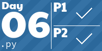
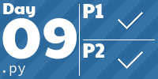
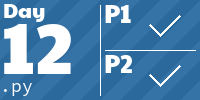
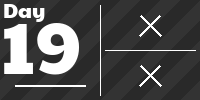

# Advent of Code 2022

This year will be done half in Python (cause of matura exam) half in c# (usually the harder ones, cause of c# is becomming my main programing language) and hopefully not be dropped after ~17 day like last year. 

(no Padoru Gwen this year :c, but at least I have some fancy aoc tiles!)
<!-- AOC TILES BEGIN -->
<h1 align="center">
  32 ⭐
</h1>

<!-- AOC TILES END -->